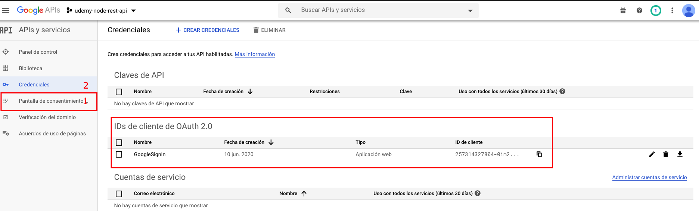
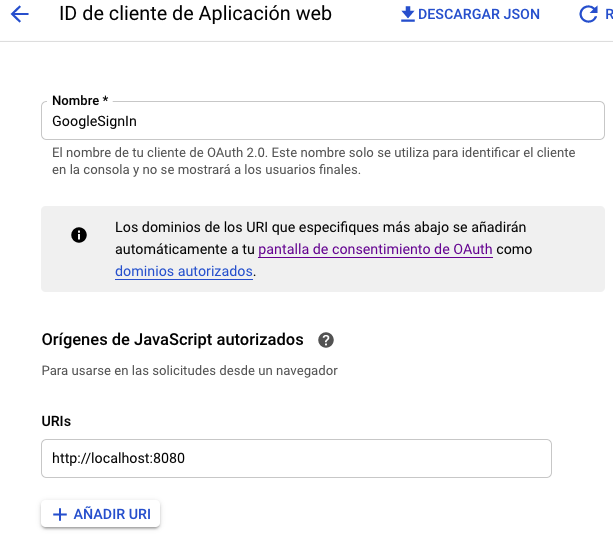

# REST API

[JSON Web Token][jwt]

### installs

With `package.json` and dependencies
```shell
docker-compose run app yarn
```

Without dependecies
```shell
docker-compose run app yarn express body-parser mongoose mongoose-unique-validator bcrypt underscore jsonwebtoken google-auth-library uuid express-fileupload mkdirp
docker-compose run app yarn --dev nodemon dotenv
```

### Start project

> run `docker-compose up`

### app service

> `localhost:8080`, you can change the port in `docker-compose.yml` file `<host-port>:8081`

#### mongo-express service

> `localhost:8081`, you can change the port in `docker-compose.yml` file `<host-port>:8080`

#### mongo service

Data persists in `/data/db` file.

### Structure

> run `tree -I "node_modules|data|screenshots"`
```shell
.
├── Dockerfile
├── README.md
├── docker-compose.yml
├── package.json
├── src
│   ├── config
│   │   └── index.js
│   ├── helpers
│   │   ├── database.js
│   │   ├── http-errors.js
│   │   └── index.js
│   ├── middlewares
│   │   ├── authentication.js
│   │   ├── index.js
│   │   └── verify-admin-role.js
│   ├── models
│   │   ├── category.js
│   │   ├── index.js
│   │   ├── product.js
│   │   └── user.js
│   ├── public
│   │   └── index.html
│   ├── routes
│   │   ├── category.js
│   │   ├── index.js
│   │   ├── login.js
│   │   ├── product.js
│   │   └── user.js
│   └── server
│       └── app.js
└── yarn.lock
```

### Heroku

To deploy to the Heroku service

> run `docker-compose run app node --version`, get the node version

Add the **engines** key to `package.json`
```json
...
  "engines": {
    "node": "14.0.0"
  }
...
```

> run `heroku login`

- Create app
> run `heroku apps:create <app-name>`

- View git remotes
> run `git remote -v`

- Push heroku
> run `git push heroku master`

- View logs
> run `heroku logs --tail`

- Open app
> run `heroku open`

- View vars
> run `heroku config`

- Create var
> run `heroku config:set <var-name>="<value>"`

- Delete var
> run `heroku config:unset <var-name>`

### Decode tocken

```javascript
function parseJwt (token) {
  var base64Url = token.split('.')[1];
  var base64 = base64Url.replace('-', '+').replace('_', '/');
  return JSON.parse(window.atob(base64));
};
```

### Google Sign-In (without using the Firebase service)

- [Google Sign-In][sign_in]
- [Console Developers][console_developers]
- [backend auth][backend_auth]

#### Console Developers
<p align="center">
  <kbd>
    
  </kbd>
</p>

In `OAuth consent screen`

- Type of user: `<External>`
- Name app: `<any-name>`

#### Client IDs

<p align="center">
  <kbd>
    
  </kbd>
</p>

> If error `idpiframe_initialization_failed not a valid origin for the client...`, delete and create a new credentials `IDs de cliente de OAuth 2.0` with `http://localhost:<your-port>` and url heroku server if exist `https://udemy-node-rest-api.herokuapp.com` in the white list.

[jwt]: https://jwt.io/
[sign_in]: https://developers.google.com/identity/sign-in/web/sign-in
[console_developers]: https://console.developers.google.com/apis/credentials
[backend_auth]: https://developers.google.com/identity/sign-in/web/backend-auth

